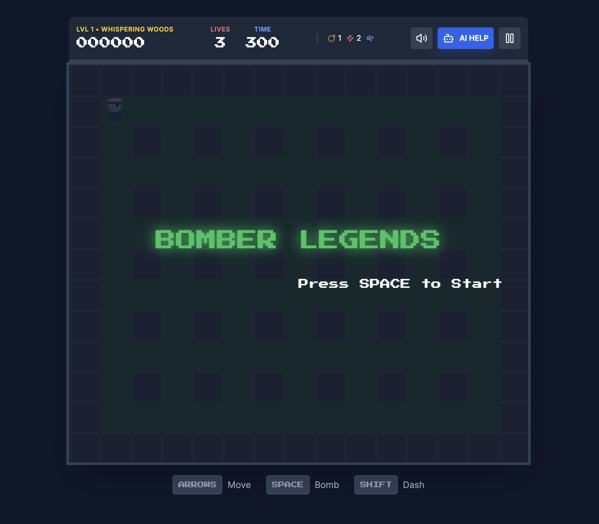
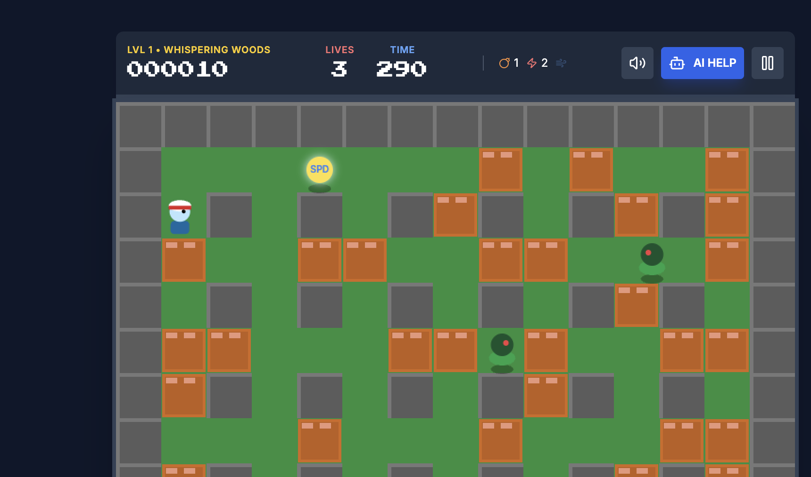
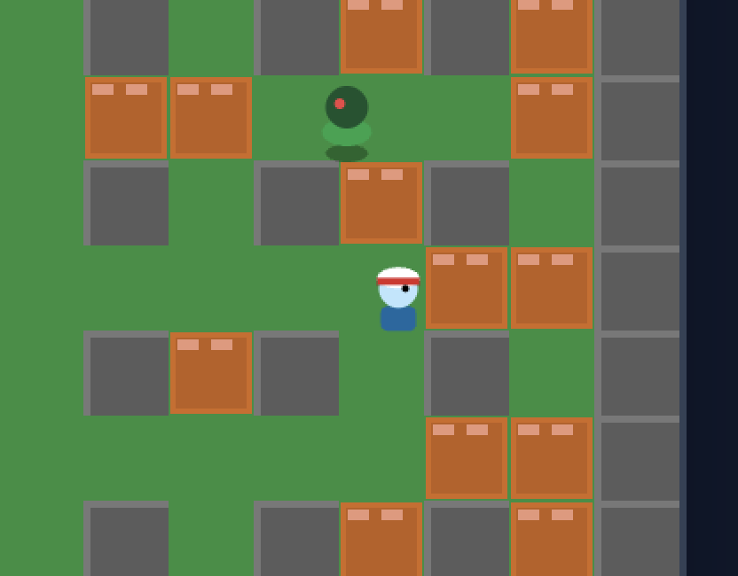
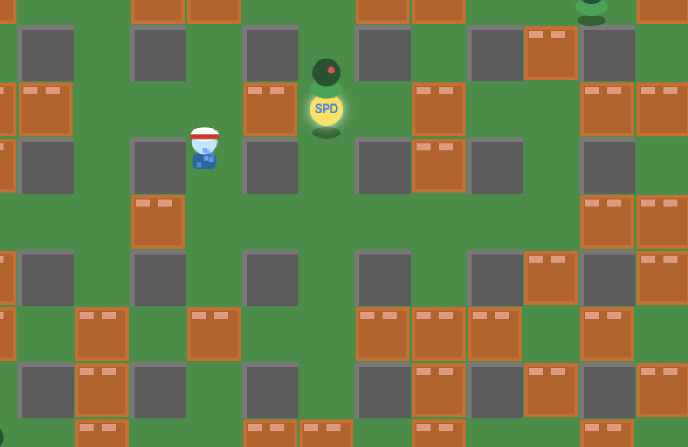

<div align="center">
  
</div>

# Bomber Legends

A classic arcade-style bomber game built with React and TypeScript. Navigate through grid-based levels, place bombs to destroy obstacles and enemies, and collect power-ups to enhance your abilities.

**Live Demo:** [bomber-legends.pages.dev](https://bomber-legends.pages.dev)

## 📸 Screenshots

<div align="center">
  
  
  
</div>

## 🎮 Features

- **Classic Gameplay**: Strategic bomb placement and grid movement.
- **Multiple Themes**: Explore different environments like Forest, River, Mountain, and Village.
- **Power-ups**:
  - 💥 **Blast**: Increases explosion range.
  - ⚡ **Speed**: Increases movement speed.
  - 💣 **Bomb**: Increases maximum bomb count.
  - 🛡️ **Shield**: Grants temporary invincibility.
  - 🦶 **Kick**: Ability to kick bombs.
- **Diverse Enemies**: Face off against Snakes, Bulls, and Demons, each with unique behaviors.
- **Responsive Controls**: Play on Desktop with keyboard or Mobile with touch controls.
- **Sound Effects**: Immersive audio for actions and events.

## 🕹️ Controls

### Desktop
- **Movement**: `Arrow Keys` or `WASD`
- **Place Bomb**: `SPACE`
- **Dash**: `SHIFT`
- **Pause**: `P`

### Mobile
- **Movement**: On-screen D-Pad
- **Place Bomb / Start**: Tap the large **BOMB** button
- **Dash**: Tap the **WIND** icon

## 🚀 Run Locally

1. **Install dependencies:**
   ```bash
   npm install
   ```

2. **Run the development server:**
   ```bash
   npm run dev
   ```

3. **Build for production:**
   ```bash
   npm run build
   ```

## 🛠️ Tech Stack

- **Frontend**: React, TypeScript, Vite
- **Styling**: Tailwind CSS
- **Icons**: Lucide React
